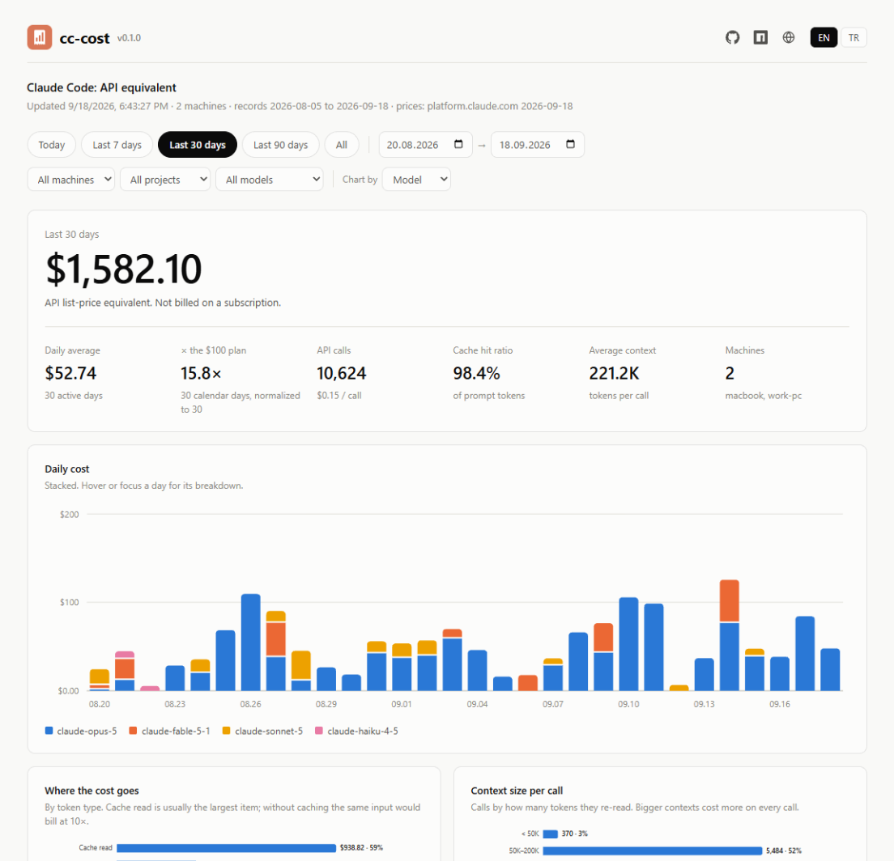

<div align="center">
  
  <h1>cc-cost</h1>
  <p>What your Claude Code usage would cost at API list prices, totalled across all your machines (Windows, Mac, Linux), with an archive that outlives Claude Code's transcript cleanup and a dashboard you open with a double-click.</p>
  <br>
  <a href="https://github.com/ugurcandede/cc-cost" target="_blank"></a>
  
  <a href="LICENSE"></a>
  <br>  
  
  
  
</div>

<br>
<p align="center">
  <picture>
    <source media="(prefers-color-scheme: dark)" srcset="docs/assets/dashboard-dark.png">
    
  </picture>
  <br>
  <sub>The dashboard, on sample data.</sub>
</p>

## Quick start

```bash
npm i -g @ugurcandede/cc-cost          # or, with Yarn 1: yarn global add @ugurcandede/cc-cost

# Pick the folder your machines share (Dropbox, iCloud Drive, OneDrive, …),
# your language and plan; schedule a daily sync and add the Claude Code hook.
cc-cost setup

cc-cost                  # sync this machine, print a summary
cc-cost report           # open the dashboard
```

Run `setup` on every machine and point them at the same folder. Each one adds its numbers; every one
sees the total.

Yarn 2 and later have no global installs: install with npm, or try a report once with
`yarn dlx @ugurcandede/cc-cost` (or `npx @ugurcandede/cc-cost`). `setup` needs a permanent install,
since the schedule and hook point at it.

## Prerequisites

- Node.js 22 or newer (no runtime dependencies)
- Claude Code, which keeps its transcripts in `~/.claude/projects`
- For several machines: a folder they all sync. Without one, cc-cost counts this machine only

## Everyday commands

```bash
cc-cost                      # sync, summary, dashboard
cc-cost daily --last 7       # also weekly, monthly; --breakdown adds per-model rows
cc-cost projects             # also models, machines, sessions
cc-cost agents               # main thread vs subagents; also skills, mcp
cc-cost insights             # context size, cache efficiency, what drives the cost
cc-cost plan                 # API equivalent vs Pro / Max 5x / Max 20x, rate-limit hits
cc-cost blocks               # usage in Claude's 5-hour windows
cc-cost status               # settings, machines, schedule, hook
cc-cost update               # update to the latest version
```

```
$ cc-cost projects --last 30
Project         Calls  Avg context  Cache read  Output       Cost   Share
─────────────  ──────  ───────────  ──────────  ──────  ─────────  ──────
api-server      4,728       207.8K      966.9M    5.7M    $722.12   45.6%
web-app         3,051       237.9K      714.2M    3.4M    $446.28   28.2%
mobile-app      1,443       214.9K      305.1M    1.7M    $198.60   12.6%
data-pipeline     533       224.9K      118.0M  500.6K     $90.86    5.7%
infra             557       231.2K      126.7M  677.1K     $77.03    4.9%
docs-site         312       265.8K       81.6M  345.3K     $47.20    3.0%
─────────────  ──────  ───────────  ──────────  ──────  ─────────  ──────
Total          10,624       221.2K       2.31B   12.3M  $1,582.10  100.0%
```

Every report takes the same filters and output options:

```bash
cc-cost daily --since 2026-09-01 --machine macbook --model opus
cc-cost sessions --project api --limit 10
cc-cost monthly --json            # or --csv
cc-cost insights --lang tr        # interface language: en (default) or tr
```

## How it differs from other tools

- **Several machines, one total**: through a folder you already sync; no server, no account.
- **History that stays**: numbers are kept after Claude Code deletes old transcripts.
- **A dashboard in one file**: date, machine, project and model filters, works offline.
- **Insights, not just totals**: context size per call, cache hit ratio, subagents, skills, MCP servers,
  the costliest sessions.
- **Current prices**: read from Anthropic's pricing page daily, with a bundled fallback.

## Layout

What cc-cost keeps in the shared folder:

```
<shared folder>/
├── machines/
│   ├── work-pc.json        # one per machine, written only by that machine
│   └── macbook.json
└── dashboard.html          # rewritten on every sync
```

and on each machine:

```
~/.config/cc-cost/          # %APPDATA%\cc-cost on Windows
├── config.json             # cc-cost config
└── pricing-cache.json      # last prices read from the pricing page
```

## Safety

- **No conversation content leaves your machine.** Snapshots hold token and call counts per day, project,
  session and model, plus rate-limit events. Project names can be hashed (`anonymizeProjects`).
- **The archive only grows.** A day older than Claude Code's cleanup window is never overwritten by a
  scan that may see only part of it.
- **No sync conflicts.** Each machine writes only its own file, through write-then-rename.
- **Your Claude Code settings are backed up** to `settings.json.cc-cost.bak` before the hook is added;
  other hooks are left alone. `cc-cost setup --remove` takes the schedule and the hook away.
- Read-only toward transcripts: cc-cost never modifies `~/.claude/projects`.

## Further reading

- [docs/cli.md](docs/cli.md): every command, filter and option
- [docs/configuration.md](docs/configuration.md): settings, the shared folder, price overrides, privacy
- [docs/how-it-works.md](docs/how-it-works.md): how costs are calculated, deduplication, the archive,
  and what cc-cost can't see
- [docs/maintenance.md](docs/maintenance.md): automatic runs, status, moving from the original script

---
<p align="center">
  Built with ❤️ for the Claude Community
</p>

<p align="center">
  <a href="https://github.com/ugurcandede">
    
  </a>
  <a href="https://claude.com/claude-code">
    
  </a>
</p>

<p align="center">
  <sub>Not affiliated with or endorsed by Anthropic. "Claude" is a trademark of Anthropic, PBC.</sub>
</p>
